# VroidMMDTools

**Other Language Versions: [English](README.md), [中文](README_zh.md)**

**5-Minute Quick Video Tutorial:**

This tool primarily focuses on converting MMD (MikuMikuDance) files into Unity-compatible `.anim` files and animation controllers, while also adding facial expressions and camera curves. It streamlines many tedious and time-consuming tasks using scripts.

1. **Toolbox Plugin**  
   Download: [https://github.com/maoxig/VroidMMDTools/releases/](https://github.com/maoxig/VroidMMDTools/releases/)

2. **MMD4Mecanim**: [http://stereoarts.jp/](http://stereoarts.jp/)  
   (Alternatively, if you already have PMX2FBX, simply set the path accordingly.)

**Regarding MMD**: This video/tool merely integrates existing tools and workflows. When converting or using MMD files, please adhere to the original MMD regulations and respect relevant copyrights. The author and this tool are not responsible for any damages caused to secondary users.

Below is the detailed text tutorial. At the end, you’ll find a section on potential issues. It’s recommended to follow the text tutorial first. If problems arise, refer to the principles, known issues, and troubleshooting steps. If issues persist, feel free to provide feedback.

---

## Text Tutorial

### 0. Project Preparation

Prepare the following: Unity, MMD4Mecanim (optional, but PMX2FBX is required), and this Unity toolbox plugin.

To import the Unity package, simply drag the `.unitypackage` file into the Unity Project window. If prompted during import, click "Yes."

### 1. Verify Toolbox Functionality

After importing the toolbox plugin, you’ll see new options in the Unity menu bar, specifically **VMD Morph Camera Animator Tool** and **VMD To Anim Converter**.

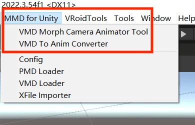

The **VMD To Anim Converter** is a dedicated tool for converting `.vmd` files to `.anim` files (an optimized re-encapsulation of MMD4Mecanim). It includes configuration options where you can verify the three paths.

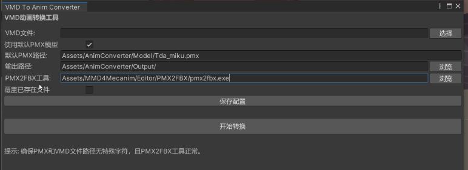

Open the **VMD Morph Camera Animator Tool** to access the main plugin window. Note: The default configurations are pre-set and should not be changed unless you know what you’re doing.

### 2. Prepare MMD Files

Place the MMD motion `.vmd` files (motion, camera, and facial expression `.vmd` files) and audio files (`.mp3`, `.ogg`, or `.wav`) into your Unity project. For organization, consider creating a `Workspace` folder. For details on acquiring these resources, check the pinned comments in the relevant discussion.

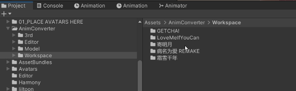

### 3. Generate Animation Clips from VMD or Use Existing Clips

There are two scenarios:

1. **Only VMD Files Available**: Drag the `.vmd` file into the tool and click to generate an animation clip.
2. **Existing `.anim` Clip**: If you’ve previously generated an animation clip (stored in the `Output` folder), you can directly import it using the provided option.

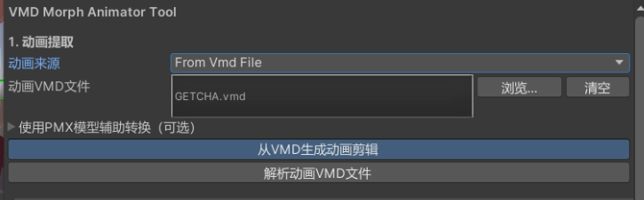

After generating the animation clip, an `.anim` file will be created in the `Output` folder. This file initially contains only character motion data. Camera and facial expression data will be added in later steps.

If an error occurs during generation, refer to the principles section. You can use MMD4Mecanim to extract the `.anim` clip and then import the existing clip.

### 4. (Optional but Recommended) Import Camera VMD

If the camera and motion data are combined in a single `.vmd` file, drag the same `.vmd` file used previously.

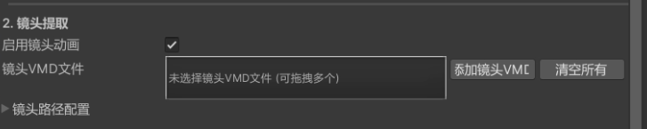

You can confidently import the camera data, as many issues have been fixed (see the referenced post for details). Camera motion is the soul of MMD, so it’s highly recommended to include it.

**New Feature**: The latest toolbox version includes a camera scaling option. For example, if a camera `.vmd` is designed for a 1.8m-tall character, the focal point will be set at 1.8m. If your character is only 1.6m tall, the camera may focus above the character’s head in-game. To fix this, scale the camera by a factor of 1.6/1.8 = 0.88 when importing the `.vmd`.

### 5. Import Facial Expression VMD

Typically, facial expressions and motion are included in the same `.vmd` file, so you can reuse the previous `.vmd`. However, some files separate them, so the panel is designed to handle both cases.

### 6. Combine Animation Curves and Create Controller

Preview the morph key mappings, select the curves you want to add, and click **Add to Animation and Create Controller**.

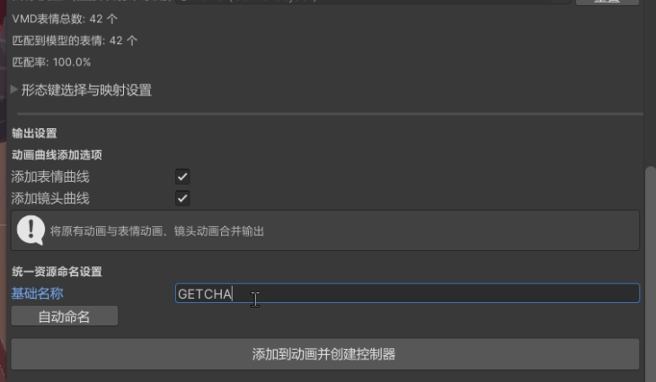

If the creation fails, a known issue is that selecting too many morph key mappings may cause errors (the exact cause is unknown). Try deselecting some morph keys and retry.

At this point, you could add audio and export, but it’s recommended to perform the following checks for safety.

**Important**: Starting from version 0.0.4, a one-click preview button is available using Unity’s Timeline (included by default, though older Unity versions like 2017.1 or earlier may require installation). Drag an existing character model into the designated slot and click to preview:

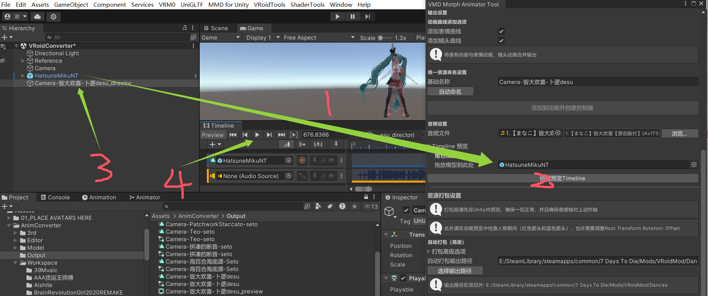

To preview the camera in Unity, you need a camera node that adheres to specific standards. A provided script automates the creation of a compliant camera. After creating it, click the Timeline’s play button to view the camera motion directly in the Game window without running the game. This combines the next three steps into one, significantly improving efficiency.

### 6.5 Audio Check (Optional)

Ensure the audio file is appropriately sized. Then verify that the audio aligns with the motion and syncs correctly.

- **Case 1**: If the motion distribution includes an audio file (`.mp3`, `.ogg`, `.wav`), it typically doesn’t need checking—just drag it in.
- **Case 2**: For self-downloaded music, verify the beat alignment and adjust the audio if necessary (e.g., if it’s missing or has extra frames). Use Unity’s Timeline to check alignment or adjust audio with external tools. Here are two methods for reference (though better methods may exist):

  1. **Simple Case**: If the audio is noticeably off (e.g., missing or extra duration), use `ffmpeg` to trim or adjust it.
  2. **Complex Case**: Refer to [this Bilibili post on extracting audio and aligning](https://www.bilibili.com/opus/570596146267836164). Extract the audio from a distributed video (search for online extractors), identify the matching frame in Timeline, and calculate the audio offset.

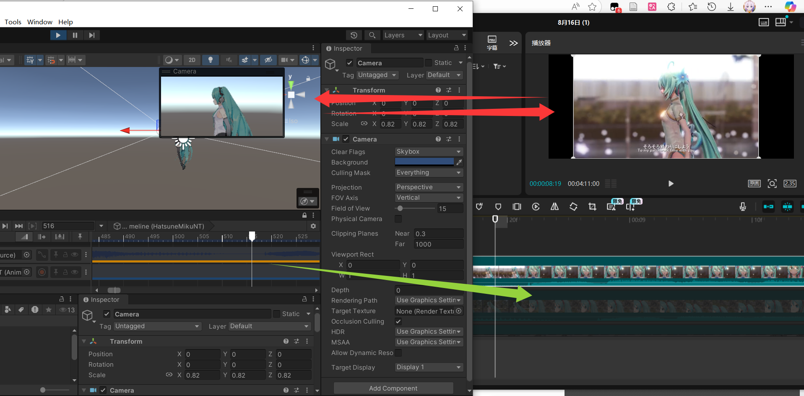

Afterward, fine-tune the audio using the toolbox’s simple audio editor. The editor uses `ffmpeg` (optional), which you can source from your computer (many audio/video software packages include it).

### 7. Character Orientation Check (Optional)

Locate the newly created animation in the `Output` folder and preview it. Ensure the character’s facing direction (red arrow) aligns with the blue arrow most of the time. If misaligned, adjust the first offset in the **Root Transform Rotation** panel.

If the character’s initial position is incorrect, try setting the **Center of Mass** to "Original."

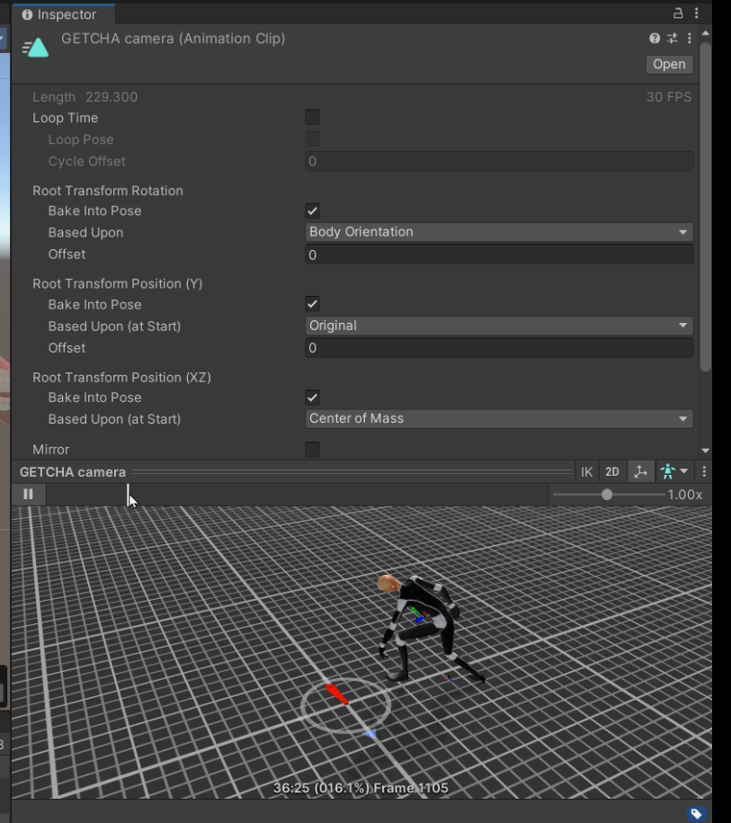

### 8. Final Check (Optional)

Use an existing character model (e.g., a VRM model) to verify that the skeleton, motion, facial expressions, and camera (if included) work correctly. To preview the camera in Unity, create a compliant camera node using the provided script.

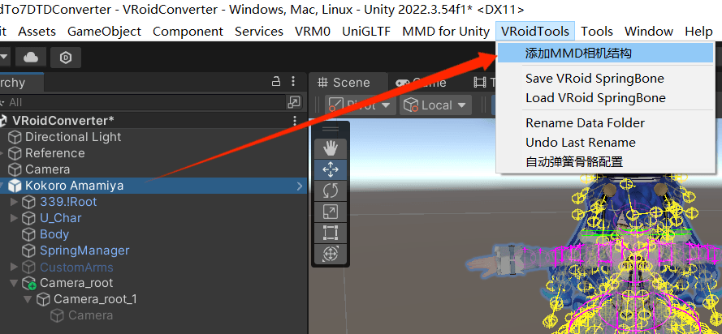

For exporting character models to games, the camera is typically not needed—this is only for Unity testing.

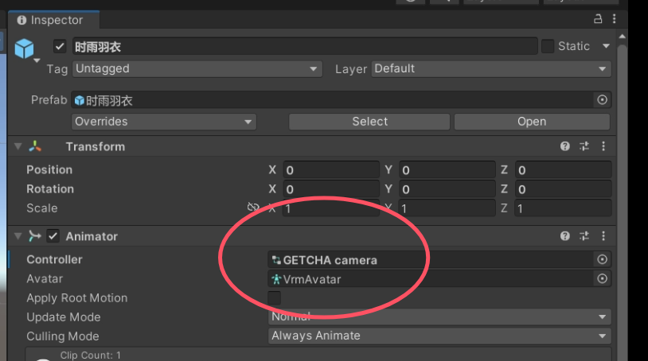

Drag the generated controller from the `Output` folder to the character model’s Animator component. Clicking "Play" will animate the character, allowing you to check the camera, expressions, and motions.

Alternatively, use Timeline for inspection, as it allows simultaneous checking of audio, motion, and camera without needing to play the game (which saves time and allows editing).

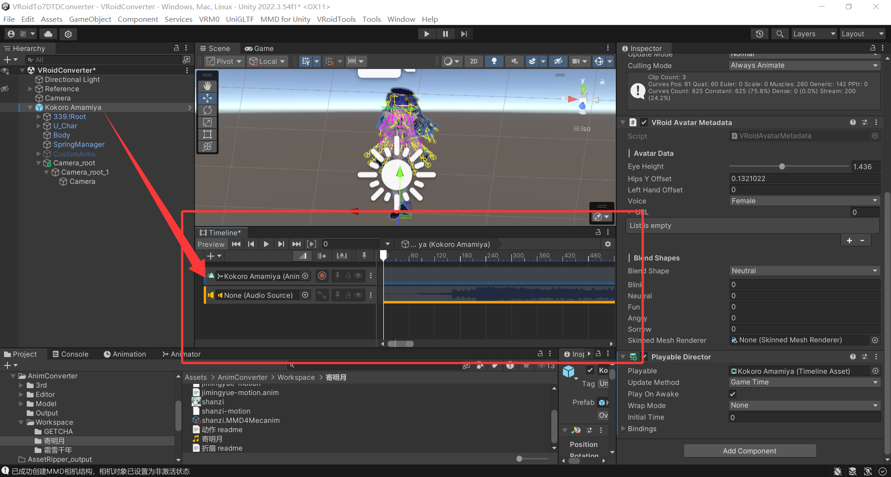

### 9. Package and Export

If everything is correct, click the package button to export. The tool automatically detects, renames the controller, animation, and audio, and outputs a `.unity3d` file. Set the output path to the `dances` folder to check the results directly in-game.

---

## Potential Issues

1. **Lip Expression Parsing Errors**: For tools like GETCHAT, lip expressions may fail to parse, likely due to issues with the `.vmd` file or the outdated parsing library. A workaround is to re-import the lip data in MikuMikuDance and re-export the `.vmd` file to refresh it, which should resolve the issue.

2. **Motion Issues with VMD Files**: Some dance `.vmd` files rely heavily on the bone structure of the provided `.pmx` model. If errors occur (e.g., erratic motion, tangled limbs, or floating characters), try using a more compatible `.pmx` model. In some cases, you may need to modify the model’s bones using PMX Editor.

3. **Incorrect Initial Position or Orientation**: If the extracted `.anim` clip has correct motion, expressions, and camera but the initial position or direction is off, this is likely a Unity issue. Refer to Step 7 and adjust the panel options (e.g., Root Transform Rotation or Center of Mass).

