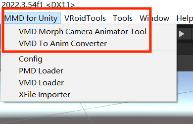
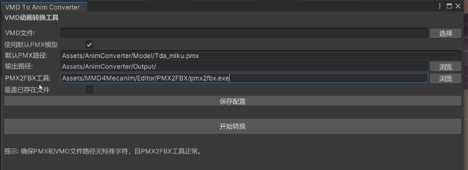
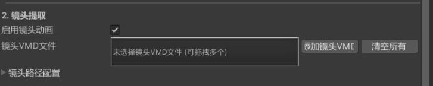
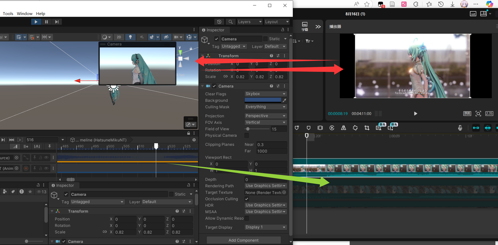
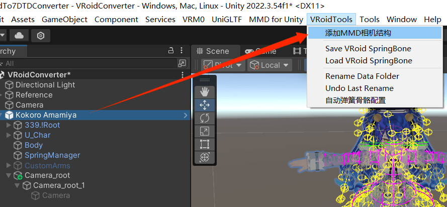

# VroidMMDTools

**其他语言版本: [English](README.md), [中文](README_zh.md)**

5分钟极速版视频教程：

主要是关于MMD转换成unity可用的anim和controller，并且添加表情和镜头曲线，利用脚本优化了许多繁琐费时的工作

1. 小工具箱插件

https://github.com/maoxig/VroidMMDTools/releases/

2. MMD4Mecanim: http://stereoarts.jp/

（或者如果已经有PMX2FBX直接设置下路径就行）

关于MMD，本视频/工具仅仅是整合了一些已有的工具/思路，在转换、使用时请遵守原MMD的相关规定，尊重相关著作权。如有对二次使用者造成的损害，与本人、本工具无关。

下面是图文教程，最后面有可能出现的问题，你可以先跟着图文过一遍，如果有问题优先看原理、存在的问题，然后想办法解决，如果还是有问题可以反馈。

——————————————————————————————

图文教程：

### 0. 准备项目

下载准备好Unity, MMD4Mecanim（可选，但是得有PMX2FBX），以及这个unity工具箱就行

导入unity包只需把.unitypackage拖进project里，如果导入时有提示按yes即可。

### 1. 确保这个工具箱是正常的

导入工具箱插件之后，会在窗口上面多几个选项，主要是关注**VMD Morph Camera Animator Tool**和**VMD To Anim Converter**这两个选项。

其中VMD To Anim Convter是单纯的**vmd转anim**的工具（把MMD4Mecanim重新封装优化了一下），里面也有一些配置，可以检查一下三个路径，可以检查一下配置。

然后点击打开**VMD Morph Camera Animator Tool**，进入插件主窗口。

这里说明一下，里面提供的配置默认都是设置好的，如果不知道要不要改那就是不要改。

### 2. 准备MMD文件

把要处理的MMD 动作.vmd，（镜头.vmd，表情.vmd）和音频（.mp3/.ogg/.wav）文件夹放到项目里（可以创个Workspace整洁一些）。这些资源获取的问题见评论区置顶。

### 3. 从vmd生成动画剪辑，或者使用已有的动画剪辑

这里有两种情况，一种是只有vmd文件，就把vmd拖进去，然后点击生成动画剪辑。

还有一种情况是已经有了animClip（比如之前已经执行过生成动画剪辑，此时可以直接用Output里面存的），因此，也提供了直接使用anim的导入选项。

点击从vmd生成动画剪辑之后，会在output里面生成一个anim文件，但是此时这里的anim是只包含人物运动数据的anim，因此我们在后面添加上镜头和表情。

在生成动画剪辑时，如果出错，建议看一下原理，使用MMD4Mecanim提取出animClip，然后使用已有的animClip

### 4. （可选但推荐）导入镜头vmd

有些MMD的镜头和动作放在一个vmd里面，这时候还是拖前一个vmd就行。

你现在可以放心导入镜头，因为我已经在下面这个帖子里修复了很多问题，而且镜头是MMD的灵魂所在，我建议你加上。

新版本的工具箱多了一个镜头缩放的选项，我举个例子你就知道这是干嘛的：有一些镜头vmd是针对身高1.8m的角色设计的，那么在贴脸对焦时就会对焦在1.8m，那如果角色模型只有1.6m高，那此时在游戏里，镜头就会对焦在头顶上，所以在导入vmd时要缩放一下镜头（乘上1.6/1.8=0.88）。

### 5.导入表情vmd

通常MMD的表情和动作放在一个vmd里面，这时候还是拖前一个vmd就行，但是有一些是分开的，所以我在设计面板时拆开来了

### 6.合并动画曲线、创建控制器

预览形态键映射设置，选择你需要添加的曲线，然后点击**添加到动画并创建控制器**

这里如果创建失败，我目前已知的有些问题是如果形态键写入的太多有时候会报错，我也没找出原因，可以试试取消选择一些形态键映射。

其实到这一步就已经可以添加音频并打包输出了，但是我们稳妥一些检查两步。

**重要：新版本（v0.0.4之后）提供了一个基于Unity Timeline（通常会自带，非常古老的unity2017.1以下可能得装一下）的一键预览按钮，只需要拖一个已有的人物模型到框内，然后点击之后可以一键预览：**

此外要在unity内部预览镜头的话得在人物节点创建一个一定规范的镜头，我已经提供了一个脚本一键创建符合规范的镜头，允许创建脚本、点击按钮后，再点击Timeline的播放，你可以直接在game窗口直接看到运镜的效果，而不需要播放游戏，因此后面三步可以合并到一步，大大提高检查效率。

### 6.5 检查步骤：音频检查（可选）：

这里建议音频不要太大，适当即可。然后我们需要检查音频和动作踩点、同步。

情况一：动作配布里面提供了音频.mp3/.ogg/.wav通常不需要检查，直接拖进去就行；

情况二：自己下载的音乐，我们得首先检查音乐踩点没，然后调整下音频（通常音频可能缺失/多几帧）。检查对轴可以用unity的Timeline功能，调整音频可以用其他音频工具、插件。这里说一下我的两种方法，仅供参考，也许有更好的方法：

1. 比较简单的情况，例如很明显可以观察到音频缺失、多了多久，直接使用ffmpeg修改一下音频

2. 比较复杂的情况，可以参考：[【MMD相关】扒音轨和对轴 - 哔哩哔哩的思路](https://www.bilibili.com/opus/570596146267836164)。可以把配布视频扒下来（搜在线提取器），然后在Timeline里面找画面相同的那一帧，然后看音频差了多少，

之后简单微调一下音频即可，工具箱里提供了一个简易音频编辑器，其中用到的ffmpeg（可选）可以随便用电脑里有的就行（因为大部分音频、视频软件里面可能都塞了一个）

### 7. 检查步骤：人物方向检查（可选）

找到Output新创建的动画，预览一下，确保人物面对的方向（红色箭头）和蓝色箭头在大部分时候基本上对齐，不对齐的话可以拖动修改第一个offset（Root Transform Rotation那个）。

如果人物的初始位置很奇怪，可以尝试改第三个Center of Mass改为original

### 8. 检查步骤：最终检查（可选）

利用一个已有的人物检查一切正常（可以用vrm的人物预览一下），主要是关注骨架、动作、表情、镜头（可选）。要在unity内部预览镜头的话得在人物节点创建一个一定规范的镜头，我已经提供了一个脚本一键创建符合规范的镜头；

不过正常导出角色模型到游戏里是不需要带镜头的，我们这里只是为了在unity里面测试

我们把刚刚的output里面生成的controller拖到人物模型的这里，这样你点击播放play之后，角色就会动起来，可以检查镜头、表情、动作等等。

此外，你也可以像之前那样使用Timeline检查，我比较喜欢用Timeline，因为可以同时检查音频、动作、镜头，并且不需要点击play播放就能检查（播放的话unity得等几秒，而且不能编辑修改）

### 9. 打包输出
一切无误就可以点击打包按钮打包导出了，自动打包会自动检测、重命名控制器、动画、音频，然后输出为unity3d。可以直接把打包输出路径设在dances路径下，这样打开游戏就能检查是否有问题

————————————————————————————————————

可能的问题：

1. 有些例如GETCHAT好像嘴唇表情好像在解析时报错了，但是似乎是vmd本身或者解析库的问题，因为那个解析库是一个几年的老东西了，即使怀疑是它的问题也无能为力。最终我的解决方案是，利用MikuMikuDance把嘴唇数据重新导入，然后再重新导出（相当于刷新一下），这样就能成功解析嘴唇了

2. 有些舞蹈vmd非常依赖于提供解析的pmx模型骨骼，如果解析时报错、动作抽风、脚部手臂打结、人物飘逸飞天等等，需要更换一个更加适配的pmx模型（有些可能需要用pmxeditor改模修改骨骼适配）

3. 如果提取出来的animClip里面，动作、表情、镜头都一切正常，但是初始位置、方向等等不正常，这通常是unity抽风，去第7步看那个面板调节那几个选项试试

